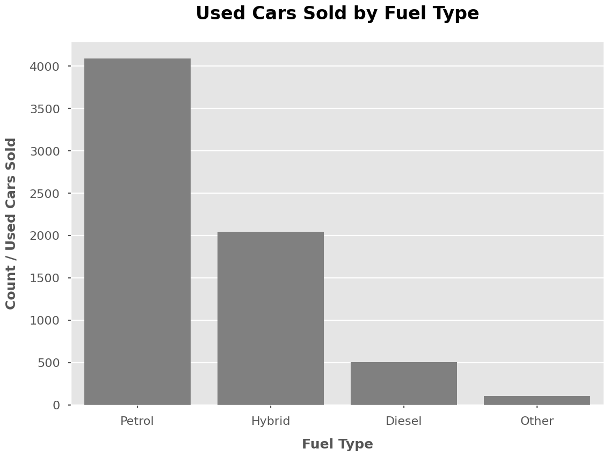
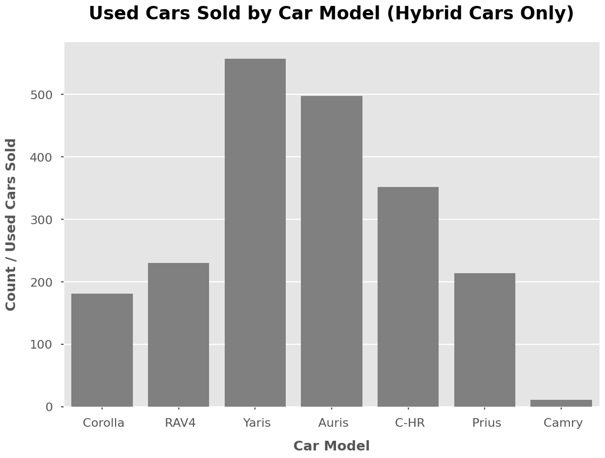
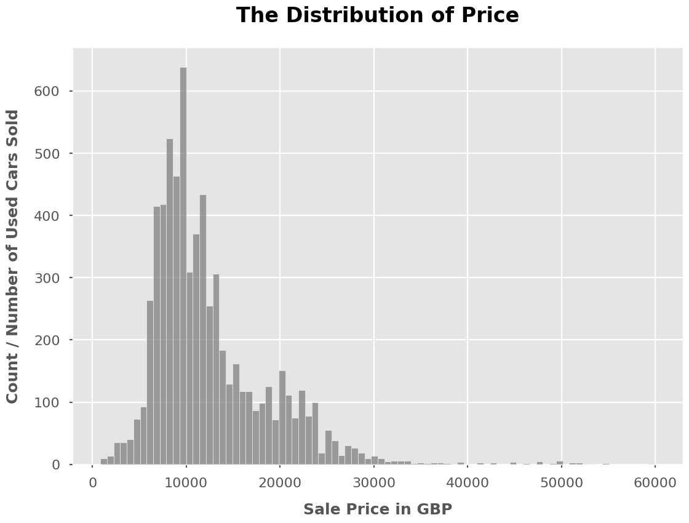
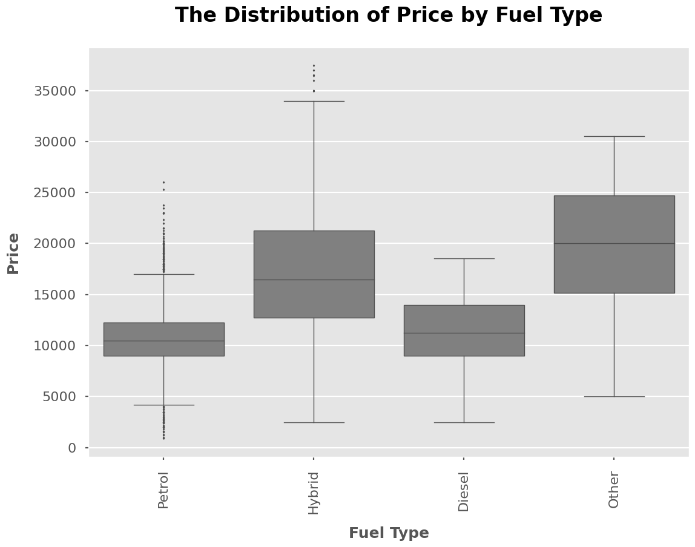
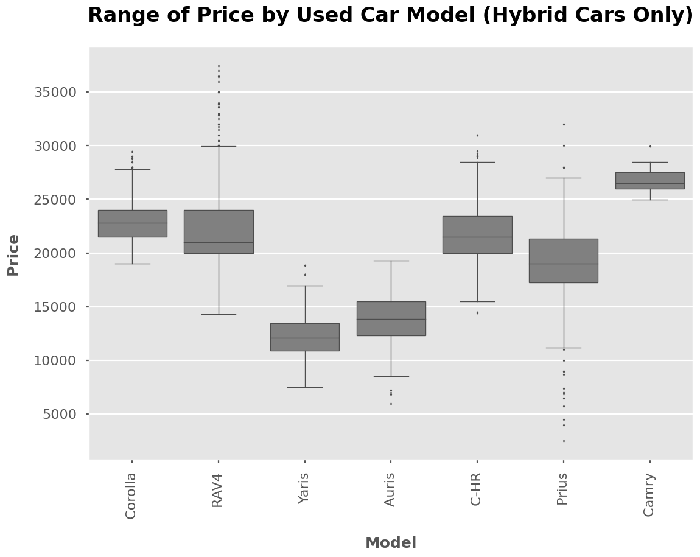

# Discount-Motors

Discount Motors is a used car dealership in the UK. They want to lead the way in used cars.
Selling to customers who want the latest and greatest features, without the price tag of a
brand new car.

The UK Government has now announced that from 2030 all new cars will be required to be
zero emissions. Although this won’t impact the used car market, it is expected that buyers will
give more consideration to the future value of their cars. And petrol and diesel will likely have
a much lower value after 2030.

 

 ##  Data Validation

The dataset contains **6738 rows and 9 columns** before cleaning and validataion. I have validated all the columns against the criteria in the dataset table:

- model: 18 models without missing values, same as the description. No cleaning is needed.
- year: 23 unique values without missing values, from 1998 to 2020, same as the description. No cleaning is needed.
- price: numeric values without missing values, same as the description. No cleaning is needed.
- transmission: 4 categories without missing values, same as the description. No cleaning is needed.
- mileage: numeric values, same as the description. No cleaning is needed.
- fuelType: 4 categories without missing values, same as the description. No cleaning is needed.
- mpg: numeric values without missing values, same as the description. No cleaning is needed.
- engineSize: 16 possible values without missing values, same as the description. No cleaning is needed.

After the data validation, the dataset contains **6738 rows and 9 columns** without missing values.

## How the Sales Differ Between Hybrid Cars and Other Fuel Types?
From the last 6 months' record, more than half of the used cars we sold are using petrol, followed by using hybrid. Also, we can see the number of cars sold in petrol is almost twice the number of cars sold in hybrid. Therefore, we can conclude that there is huge room to improve the sales of hybrid cars. 

If we only look at hybrid cars. From the bar chart below, the best seller in car models is Yaris, followed by Auris and C-HR.

We also want to compare the price of all the cars we sold last 6 months. I was looking at the distribution of price. The majority of used cars sold last 6 months is less than 30000 GBP. Used cars sold for more than 30000 GBP could be considered outliers.

From the multiple boxplots below, we can see the price range in hybrid cars is more significant than other fuel types. The majority of the price of a hybrid car range from 13000 to 21000 GBP, which is higher than petrol and diesel. I am not sure of the meaning of the fuel type in ‘Others,’ so I cannot conclude anything about that type until I have further information.

Petrol cars, the largest rival of the hybrid cars, majorly sold from 9000 to 12000 GBP. But as you can see from this graph, a few hybrid cars are also sold in this range.

## How to Make the Hybrid more Attractive?
Since the Hybrid models are more expensive than other types on average, we will find different ways to attract customers. From the multiple boxplots below, **Prius, Yaris and Auris** have records of selling lower than 10000 GBP in the last 6 months, which is competitive with the petrol cars. Therefore, for people concerned about price, we should make these three models our major campaign car models.

The other attractive information is the tax. From the bar chart below, we can see the most common road tax for the petrol model is 145 GBP,  while the most common road tax for the hybrid model is 0 GBP. Therefore, for people buying traditional fuel-type car models, a Hybrid might be an excellent choice based on this information.

## Business Metrics
Since our goal is to increase the number of sales of hybrid and electric cars next year, I would recommend we use **the percentage of hybrid and electric cars in total number of used cars sold last 6 months** as our metric. 

Based on our last 6 month data, 30% of the used cars sold are hybrid and electric cars. Therefore, if this number is increasing next 6 month, it indicates very good sign to achieve our goal.

## Recommendation
For the following weeks, I would recommend we can focus on the following steps:
- Using key metrics to monitor whether there is a strong sign to see the sales will increase.
- To implement the campaign as soon as possible, we should smartly promote the hybrid models in the market:
  - Promoting road tax reduction
  - Less expensive models -Prius, Yaris and Auris model 
- Stay on top of the current electric and hybrid car markets so that the newest information can be integrated in the campaign.
- Data Collection for in-depth analysis
  - Improve data quality - what the other fuel type means?
  - New related data - Using different fuel types in the same car model to compare eco-friendly cars and other fuel types

